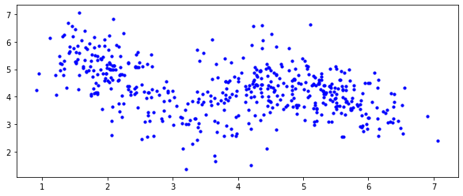
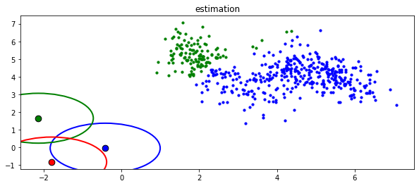
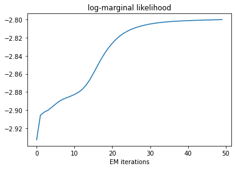
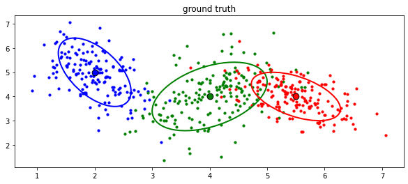
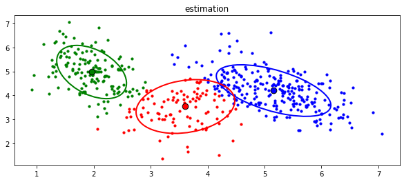
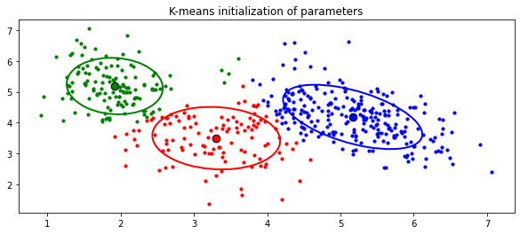

# Gaussian mixture model estimation with the EM algorithm


Image credit:  [Bayesian Learning for Signal Processing](https://members.loria.fr/ADeleforge/files/bayesian_inference_electronic.pdf), Antoine Deleforge, LVA/ICA 2015 Summer School.


```python
import numpy as np
import scipy as sp
from scipy.stats import norm
from scipy.stats import multivariate_normal
import matplotlib
import matplotlib.pyplot as plt

from gmm_tools import plot_GMM, plot_data, generate_Bayes_adventures_data

np.random.seed(12)
```

On Tuesday October 7, 1949, Thomas Bayes is going to visit Oxford University. Upon arriving at the university, three prankster students throw dozens of small stones at him from the roof. Bayes wants to know which student has thrown which stone. Determined, he begins to note the 2D position of each single stone on the ground.


```python
N = 500 # number of samples (number of stones)
D = 2 # number of dimensions (x and y coordinates)

gen = generate_Bayes_adventures_data(N, D)
x = gen[-1]

plot_data(x)
print(x.shape)
```

    (500, 2)
    





# Theoretical work

## Generative model


For his investigation, Thomas Bayes defines the generative process of the observed data as follows:

He observes a realization of a set of **observed random variables** denoted by $ \mathbf{x} = \{\mathbf{x}_n \in \mathbb{R}^2\}_{n=1}^N$, where $\mathbf{x}_n$ corresponds to the 2D position of the $n$-th stone.

These observations are generated from a set of **latent unobserved random variables** denoted by $ \mathbf{z} = \{z_n \in \{1,...,K\} \}_{n=1}^N$, where $z_n$ denotes the identity of the student (among $K=3$ students) who threw the $n$-th stone.

The relationships between the latent and observed variables are defined by their **joint distribution**, also called **complete-data likelihood**:


$$ 
\begin{aligned}
p(\mathbf{x}, \mathbf{z}; \theta) &= \prod_{n=1}^N p(\mathbf{x}_n | {z}_n; \theta) p({z}_n; \theta)  \\
&= \prod_{n=1}^N \prod_{k=1}^K \left( p(\mathbf{x}_n | {z}_n=k; \theta) p({z}_n=k; \theta) \right)^{\mathbb{1}\{z_n = k\}},
\end{aligned}
$$

where $\mathbb{1}\{z_n = k\} = \begin{cases}1 & \text{if } z_n = k \\ 0 & \text{otherwise}\end{cases}$.


The **prior** over the latent variables follows a [categorical distribution](https://en.wikipedia.org/wiki/Categorical_distribution):
$$ p({z}_n=k; \theta) = \pi_k, \qquad k \in \{1,...,K\}, \qquad \text{with }\, \pi_k > 0\, \text{ and }\, \sum_{k=1}^K = 1. $$

The **likelihood** is [Gaussian](https://en.wikipedia.org/wiki/Multivariate_normal_distribution):

$$ p(\mathbf{x}_n | z_n=k; \theta) = \mathcal{N}(\mathbf{x}_n; \boldsymbol{\mu}_k, \boldsymbol{\Sigma}_k),$$

with $\mathcal{N}(\mathbf{x}; \boldsymbol{\mu}, \boldsymbol{\Sigma}) = \displaystyle \frac{1}{\sqrt{\det(2\pi \boldsymbol\Sigma)}} \exp\left(-\frac 1 2 ({\mathbf x}-{\boldsymbol\mu})^\mathrm{T}{\boldsymbol\Sigma}^{-1}({\mathbf x}-{\boldsymbol\mu})\right).$

The set of **unknown deterministic model parameters** is defined by:

$$ \theta = \{\pi_k, \boldsymbol{\mu}_k, \boldsymbol{\Sigma}_k\}_{k=1}^K. $$

The **complete-data log-likelihood** is therefore given by:
$$ \ln p(\mathbf{x}, \mathbf{z}; \theta) =  \sum_{n=1}^N \sum_{k=1}^K \mathbb{1}\{z_n = k\} \left(\ln \pi_k + \ln \mathcal{N}(\mathbf{x}_n; \boldsymbol{\mu}_k, \boldsymbol{\Sigma}_k) \right). $$

## Expectation-Maximization algorithm

As direct maximum log-marginal likelihood estimation is intractable, we will derive an expectation-maximization (EM) algorithm.


Let $\tilde{\theta}$ denote the current estimate of the model parameters. Using the above definition of the complete-data log-likelihood, solve the E-step, that is compute the so-called $Q$-function, defined by: 

$$\begin{aligned}
Q(\theta, \tilde{\theta}) &= \mathbb{E}_{p(\mathbf{z} | \mathbf{x}; \tilde{\theta})}[\ln p(\mathbf{x}, \mathbf{z}; \theta)] \end{aligned}$$

Make the depency on the model parameters $\theta = \{\pi_k, \boldsymbol{\mu}_k, \boldsymbol{\Sigma}_k\}_{k=1}^K$ explicit (any constant with respect to these parameters can be omitted).

**Hints:**
- The expectation of a sum is the sum of the expectations.
- $\mathbb{E}_{p(\mathbf{z} | \mathbf{x}; \tilde{\theta})}[f(\mathbf{z}_n)] = \mathbb{E}_{p(\mathbf{z}_n | \mathbf{x}_n; \tilde{\theta})}[f(\mathbf{z}_n)]$ for any arbitrary function $f$;
- $\mathbb{E}_{p(\mathbf{z}_n | \mathbf{x}_n; \tilde{\theta})}[\mathbb{1}\{z_n = k\}] = \sum\limits_{z_n = 1}^K \mathbb{1}\{z_n = k\} p(\mathbf{z}_n | \mathbf{x}_n; \tilde{\theta}) = p(\mathbf{z}_n = k | \mathbf{x}_n; \tilde{\theta}) = r_{n,k} $.


The update for $\pi_k$ is obtained by maximizing $Q(\theta, \tilde{\theta})$ under the constraint that $\sum_{k=1}^K \pi_k = 1$. We obtain:

$$ \pi_k = N_k / N, $$

where $N_k = \sum_{n=1}^N r_{n,k}$. The optimal prior probablity $p(z_n = k) = \pi_k$ is thus given by the number of points $N_k$ in cluster $k$ divided by the total number of points $N$.

To obtain this expression you have to use the method of [Lagrange multipliers](https://en.wikipedia.org/wiki/Lagrange_multiplier): 

- you first cancel the partial derivative of the following Lagrangian w.r.t $\pi_k$:

    $$ \mathcal{L}(\theta, \tilde{\theta}, \lambda) = Q(\theta, \tilde{\theta}) + \lambda \left(\sum_{k=1}^K \pi_k - 1\right). $$

- then you simply inject this solution into the constraint to find out the solution for $\lambda$.

The ```GMM``` class defined in the previous cell implements a Gaussian mixture model. It has two important methods:
- ```init_param()``` initializes the model parameters
- ```fit()``` runs the EM algorithm to estimate the model parameters. It alternates between the E- and M-steps, and after each iteration it computes the log-marginal likelihood.

In the following cell, we instantiate this class for our problem.


The LML is defined as a sum over the data points. You will divide this sum by the number of data points, so that the value of the objective function does not depend on the size of the dataset. In other words, compute the mean instead of the sum.

To assign each point to each cluster, we simply look at the argmax of the reponsabilities. Run the following cell.


```python
z_hat = np.argmax(resp, axis=1)

fig1 = plt.figure(figsize=(10,4))
ax1 = fig1.add_subplot(111)
plot_GMM(x, z_hat, gmm.means, gmm.covars, colors=['b','g','r'], ax=ax1)
ax1.set_title('estimation')
```


    Text(0.5, 1.0, 'estimation')





Updating the covariance matrix requires computing the outer product of vectors. Look at the notebook `numpy new axis trick` to help you.

#### If you got all my encouraging messages, then you are ready to fit the GMM on the data!


```python
LML = gmm.fit(data=x, n_iter=50)
```

In the following cell, we plot the log-marginal likelihood along the iterations. It should be monotonically increasing, a nice feature of the EM algorithm which is very useful for debugging: if the log-marginal likelihood decreases, there is a bug.


```python
plt.plot(LML)
plt.title("log-marginal likelihood")
plt.xlabel("EM iterations")
```


    Text(0.5, 0, 'EM iterations')





Let's have a look to the results.


```python
(pis_true, means_true, covars_true, z_true, _) = gen


fig2 = plt.figure(figsize=(10,4))
ax2 = fig2.add_subplot(111)
plot_GMM(x, z_true, means_true, covars_true, colors=['b','g','r'], ax=ax2)
ax2.set_title('ground truth')
```


    Text(0.5, 1.0, 'ground truth')





```python
resp = gmm.E_step(x)
z_hat = np.argmax(resp, axis=1)

fig1 = plt.figure(figsize=(10,4))
ax1 = fig1.add_subplot(111)
plot_GMM(x, z_hat, gmm.means, gmm.covars, colors=['b','g','r'], ax=ax1)
ax1.set_title('estimation')
```


    Text(0.5, 1.0, 'estimation')





We used synthetic data, so we actually also know the true model parameters.

This is not perfect, but not that bad either... 

## Bonus

Using the [K-means](https://en.wikipedia.org/wiki/K-means_clustering) algorithm to initialize the model parameters.


```python
y = KMeans(n_clusters=3, random_state=0).fit_predict(x)
c1 , c2 , c3 = [] , [] , []
for k in range(len(y)):
    if y[k] == 0:
        c1.append([x[k][0],x[k][1]])
    if y[k] == 1:
        c2.append([x[k][0],x[k][1]])
    if y[k] == 2:
        c3.append([x[k][0],x[k][1]])

c1 = np.array(c1)
c2 = np.array(c2)
c3 = np.array(c3)

Mean = []
mean1 = np.mean(c1 , axis=0)
Mean.append(mean1)
mean2 = np.mean(c2 , axis=0)
Mean.append(mean2)
mean3 = np.mean(c3 , axis=0)
Mean.append(mean3)


Cova = []
cova1 = np.cov(c1.T)
Cova.append(cova1)
cova2 = np.cov(c2.T)
Cova.append(cova2)
cova3 = np.cov(c3.T)
Cova.append(cova3)
        

fig1 = plt.figure(figsize=(10,4))
ax1 = fig1.add_subplot(111)
plot_GMM(x, y, Mean, Cova, colors=['b','g','r'], ax=ax1)
ax1.set_title('K-means initialization of parameters')
```


    Text(0.5, 1.0, 'K-means initialization of parameters')





# Writing the K-means initialization function


```python
 def init_param(self, pis=None, means=None, covars=None, seed=None):
        """
        Initialize the model parameters using the provided arguments 
        or randomly.
        
        Inputs 
            pis: list of prior probabilities, length equal to self.n_comp
            means: list of GMM means, length equal to self.n_comp
            covars: list of GMM means, length equal to self.n_comp
        Outputs
            None
        """
        
        if seed is not None:
            np.random.seed(seed)
        
        if pis is not None:
            self.pis = pis
        else:
            self.pis = []
            for k in np.arange(self.n_comp):
                # prior set to 1/K
                self.pis.append(1/self.n_comp)
        
        if means is not None:
            self.means = mean
        else:
            self.means = Mean

        if covars is not None:
            self.covars = covars
        else:
            self.covars = Cova
                
        if seed is not None:
            np.random.seed()
```

## Appendix


For $f:  \mathbb{R}^{I \times J} \mapsto \mathbb{R}$, the gradient is defined by $\frac{d}{d \mathbf{X}} f(\mathbf{X}) = \nabla_{\mathbf{X}}f(\mathbf{X}) =  [\frac{\partial}{\partial X_{ij}} f(\mathbf{X}) ]_{ij} $.

Below are some useful derivatives:

\begin{equation}
\frac{\partial \mathbf{x}^T \mathbf{a}}{\partial \mathbf{x}} = \frac{\partial \mathbf{a}^T \mathbf{x}}{\partial \mathbf{x}} = \mathbf{a}
\end{equation}

\begin{equation}
\frac{\partial \mathbf{x}^T \mathbf{A} \mathbf{x}}{\partial \mathbf{x}} = 2 \mathbf{A} \mathbf{x}, \qquad \text{if } \mathbf{A} \text{ is symmetric}
\end{equation}

\begin{equation}
\frac{\partial}{\partial \mathbf{X}}tr(\mathbf{A}\mathbf{X}^T) = \mathbf{A}
\label{derTrace1}
\end{equation}

\begin{equation}
\frac{\partial}{\partial \mathbf{X}}tr(\mathbf{A}\mathbf{X}) = \mathbf{A}^T
\label{derTrace2}
\end{equation}

\begin{equation}
\frac{\partial}{\partial \mathbf{X}}tr(\mathbf{X}^{-1}\mathbf{A}) = -(\mathbf{X}^{-1}\mathbf{A}\mathbf{X}^{-1})^T
\label{derTraceInverse}
\end{equation}

\begin{equation}
\frac{\partial}{\partial \mathbf{X}}\ln \det(\mathbf{X}) = \big((\mathbf{X}^T)^{-1}\big)^T
\end{equation}
